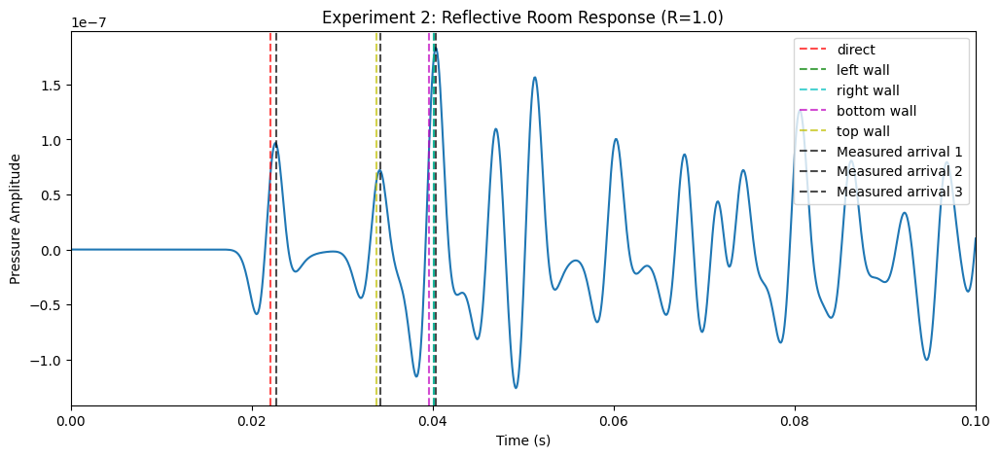
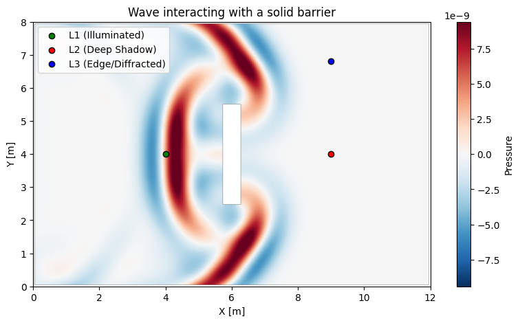
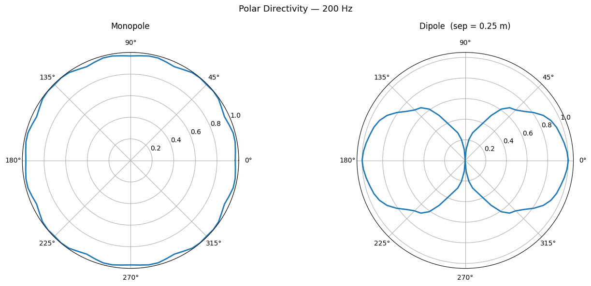
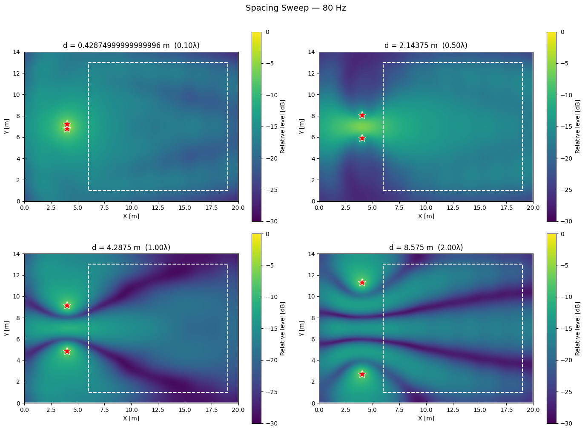
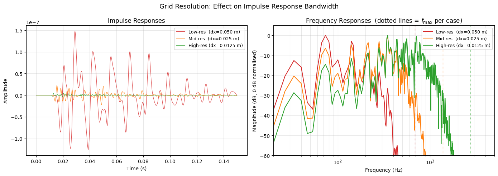

# Acoustics FDTD Lab

A Python-based finite-difference time-domain laboratory for studying acoustic wave propagation, room impulse responses, source directivity, obstacle diffraction, and band-limited auralization.

<p align="center">
  
</p>

<p align="center">
  <em>FDTD simulation of acoustic wave propagation, reflection, diffraction, and listener measurement in a 2D room.</em>
</p>

## Overview

This project implements a small computational acoustics laboratory built around the 1D and 2D acoustic wave equation. It connects numerical PDE simulation, acoustic measurement, impulse-response analysis, source directivity, diffraction, and convolution-based auralization.

The notebook sequence is designed as a progression: validate the solver, introduce sources and listeners, measure room impulse responses, study obstacles and directivity, and finally render audible examples from simulated responses.

---

## Why This Project Matters

This project demonstrates a physically motivated, wave-based simulation pipeline for studying acoustic phenomena and producing band-limited auralizations from simulated impulse responses. It connects several disciplines simultaneously:

- **Numerical PDEs** — formulating and discretizing the acoustic wave equation
- **Scientific computing** — implementing stable numerical schemes, respecting the CFL condition
- **Numerical acoustics** — validation against analytical solutions, not just visualization
- **Acoustic measurement** — virtual microphones that turn field simulations into time-domain signals
- **Signal processing** — impulse response extraction, deconvolution, convolution-based auralization
- **Software architecture** — modular, extensible solver framework that separates physics from domain geometry

The result is closer to a small computational acoustics curriculum than a set of isolated demos.

---

## Notebook Guide

| Notebook | Topic | Main idea |
|---|---|---|
| [00_FDTD_NormalModes](notebooks/00_FDTD_NormalModes.ipynb) | Solver validation | Compare numerical wave solutions with analytical normal modes; verify energy behavior and boundary conditions |
| [01_Sources_and_Listeners](notebooks/01_Sources_and_Listeners.ipynb) | Excitation and measurement | Introduce virtual microphones; record pressure signals with Ricker and harmonic sources |
| [02_Room_Impulse_Responses](notebooks/02_Room_Impulse_Responses.ipynb) | Room acoustics | Estimate direct sound, early reflections, frequency response, and Schroeder decay under varying wall absorption |
| [03_Obstacles_Diffraction_Scattering](notebooks/03_Obstacles_Diffraction_Scattering.ipynb) | Wave phenomena | Study barriers, shadow zones, corner diffraction, and double-slit interference |
| [04_Source_Directivity_and_SubwooferArrays](notebooks/04_Source_Directivity_and_SubwooferArrays.ipynb) | Directivity and arrays | Analyze monopoles, dipoles, line arrays, subwoofer spacing, phase delays, and cardioid configurations |
| [05_Basic_Auralization](notebooks/05_Basic_Auralization.ipynb) | Auralization | Convolve dry audio with simulated impulse responses; apply deconvolution to reduce source coloration |

---

## Selected Results

### Normal-Mode Validation

Notebook 00 validates the solver against analytical solutions before any other experiment. Rectangular room normal-mode frequencies are computed analytically and compared against spectral peaks extracted from simulated pressure fields. Boundary condition behavior (Dirichlet, Neumann, Robin) and energy conservation are also verified.

<p align="center">
  
</p>

---

### Room Impulse Responses

Notebook 02 uses a Ricker wavelet source and virtual microphones to extract room impulse responses under three wall conditions: fully reflective, fully absorptive, and partially absorptive. The resulting signals show clearly distinguishable direct arrivals, early reflections, and exponential decay tails. Schroeder decay curves confirm the expected reverberation behavior.

<p align="center">
  
</p>

---

### Diffraction and Obstacles

Notebook 03 demonstrates one of the core advantages of FDTD over geometric/ray-based methods: wave diffraction naturally emerges from the field equations without any special treatment. Experiments include shadow-zone formation behind barriers, edge diffraction at corners, double-slit interference patterns, and scattering from internal obstacles.

<p align="center">
  
</p>

---

### Directivity and Subwoofer Arrays

Notebook 04 places a ring of virtual microphones around a source and extracts polar directivity patterns. Configurations studied include monopole radiation, idealized dipoles (two out-of-phase sources), line arrays with varying element spacing, and cardioid subwoofer setups with phase and delay tuning. The cardioid experiments connect directly to real sound-system practice — controlling front-to-back rejection in a venue.

<p align="center">
  
</p>

<p align="center">
  

</p>

---

### Auralization

Notebook 05 closes the loop from physical simulation to listening. The workflow is: run a simulation with a Ricker-source impulse, record the pressure at a virtual microphone, apply Wiener deconvolution to remove source coloration, convolve the deconvolved impulse response with a dry audio signal, and listen to the result. Multiple experiments cover reflective vs. absorptive rooms, grid resolution effects, and stereo rendering using paired listeners.

<p align="center">
  
  
</p>

Example audio outputs:

- [Dry clap](assets/audio/CLAP1.wav)
- [Raw reflective room](assets/audio/nb5_exp1a_reflective_room_raw.wav)
- [Aligned reflective room](assets/audio/nb5_exp1b_reflective_room_aligned.wav)
- [Deconvolved reflective room](assets/audio/nb5_exp1c_reflective_room_deconvolved.wav)

---

## Key Features

- **FDTD wave solver** — explicit leapfrog scheme for the 2D acoustic wave equation, with automatic CFL-compliant time-step selection
- **Modular domain architecture** — `BaseDomain` / `Domain2D` separation; sources and listeners are registered on the domain, not on the solver
- **Spatially-varying absorption** — per-cell reflection coefficient map (`domain.materials`); automatically activates Robin boundary conditions
- **Flexible boundary conditions** — Dirichlet (pressure-release), Neumann (rigid wall), and Robin (mixed rigid-absorptive) boundaries
- **Ricker and harmonic sources** — band-limited impulse and sinusoidal excitation; composite multi-source configurations for directivity experiments
- **Virtual microphones** — `Listener` objects record time-domain pressure signals at arbitrary positions
- **Obstacle support** — rectangular and custom obstacle masks for diffraction and scattering experiments
- **Builder utilities** — `build_line_array`, `build_double_slit` for rapid experiment setup
- **Experiment framework** — `BaseExperiment` / `DirectivityExperiment` manage the setup → run → analyze lifecycle
- **Visualization** — field animations and static snapshots via `PhysicsAnimator`
- **Additional heat diffusion solver** — included to demonstrate that the PDE framework is not limited to wave propagation

---

## Installation

### Prerequisites

- Python 3.9+
- Conda (recommended) or pip
- [Git LFS](https://git-lfs.com/) — required to download audio and image assets

### Setup

```bash
# Install Git LFS (once per machine)
git lfs install

git clone https://github.com/<your-username>/Acoustics-FDTD-Lab.git
cd Acoustics-FDTD-Lab

# Create and activate environment
conda create -n acoustics python=3.10
conda activate acoustics

# Install dependencies
pip install -r requirements.txt
```

---

## Quickstart

### Wave Propagation and Impulse Response

```python
import numpy as np
from src.core.domain import Domain2D
from src.solvers.wave import Wave
from src.components.sources import RickerSource
from src.components.listeners import Listener

# 1. Create a 2D room with partially absorptive walls (R=0.8)
room = Domain2D(length=[10.0, 10.0], dx=0.05, material=0.8)

# 2. Register source and listener on the domain
source = RickerSource(pos=[5.0, 5.0], peak_freq=200, delay=0.05)
mic = Listener(pos=[7.0, 7.0])

room.add_source(source)
room.add_listener(mic)

# 3. Create solver (Robin boundaries auto-activated by absorbed walls)
solver = Wave(domain=room, c=343.0)

# 4. Step through time
steps = int(0.15 / solver.dt)
for _ in range(steps):
    solver.step()

# 5. Access the recorded impulse response
t, signal = mic.get_time_series()
```

### Directivity Measurement

```python
from src.core.domain import Domain2D
from src.solvers.wave import Wave
from src.components.sources import HarmonicSource
from src.experiments import DirectivityExperiment

room = Domain2D(length=[12.0, 12.0], dx=0.05, material=0.0)  # anechoic

source = HarmonicSource(pos=[6.0, 6.0], frequency=300.0)
room.add_source(source)

experiment = DirectivityExperiment(
    domain=room,
    solver_class=Wave,
    radius=2.5,
    num_points=72,
    c=343.0
)

experiment.setup()
experiment.run(duration=0.12)
results = experiment.analyze()

angles = results['angles']
magnitudes = results['magnitudes']
```

### Obstacle and Diffraction

```python
from src.core.domain import Domain2D
from src.solvers.wave import Wave
from src.components.sources import RickerSource
from src.utils.builders import build_double_slit

room = Domain2D(length=[10.0, 8.0], dx=0.04, material=0.0)

# Insert a barrier with two apertures
build_double_slit(
    domain=room,
    wall_x=4.5,
    slit_width=0.4,
    slit_separation=1.5
)

source = RickerSource(pos=[1.5, 4.0], peak_freq=300, delay=0.03)
room.add_source(source)

solver = Wave(domain=room, c=343.0)

steps = int(0.08 / solver.dt)
for _ in range(steps):
    solver.step()
```

---

## Project Structure

```text
Acoustics-FDTD-Lab/
├── notebooks/
│   ├── 00_FDTD_NormalModes.ipynb
│   ├── 01_Sources_and_Listeners.ipynb
│   ├── 02_Room_Impulse_Responses.ipynb
│   ├── 03_Obstacles_Diffraction_Scattering.ipynb
│   ├── 04_Source_Directivity_and_SubwooferArrays.ipynb
│   └── 05_Basic_Auralization.ipynb
│
├── src/
│   ├── core/
│   │   ├── domain.py        # BaseDomain, Domain2D — grids, geometry, obstacle masks
│   │   └── pdesolver.py     # PDESolver base class — time stepping, source field, Laplacian
│   │
│   ├── solvers/
│   │   ├── wave.py          # FDTD wave solver (NumPy, CPU)
│   │   ├── wave_jax.py      # FDTD wave solver (JAX, JIT-compiled, GPU-capable)
│   │   └── heat.py          # Heat diffusion solver
│   │
│   ├── components/
│   │   ├── sources.py       # RickerSource, HarmonicSource, and composite sources
│   │   └── listeners.py     # Listener — virtual pressure microphones
│   │
│   ├── experiments.py       # BaseExperiment, DirectivityExperiment, ImpulseResponseExperiment...
│   │
│   ├── visualization/
│   │   └── animator.py      # PhysicsAnimator — field animations and snapshots
│   │
│   └── utils/
│       ├── builders.py      # build_line_array, build_double_slit, build_smart_speaker
│       └── utils.py         # Helper functions, initial-condition generators
│
└── assets/                  # Audio output files, result images
```

| Module | Responsibility |
|---|---|
| `core/domain.py` | Spatial grids, coordinate conversion, obstacle masks, material maps, source/listener registration |
| `core/pdesolver.py` | Solver lifecycle, source field assembly, discrete Laplacian |
| `solvers/wave.py` | Acoustic wave propagation, Robin/Neumann/Dirichlet boundaries |
| `solvers/wave_jax.py` | (In progress...) GPU-accelerated wave solver via JAX JIT compilation |
| `solvers/heat.py` | Heat diffusion (demonstrates framework generality) |
| `components/sources.py` | Time-dependent source models (Ricker, harmonic, composite) |
| `components/listeners.py` | Virtual microphone recording |
| `experiments.py` | High-level experiment lifecycle management |
| `visualization/animator.py` | Interactive field animations |
| `utils/builders.py` | Geometry builders for common experiment setups |

---

## Scientific Background

The core solver implements an explicit leapfrog FDTD scheme for the 2D acoustic wave equation:

$$\frac{\partial^2 p}{\partial t^2} = c^2 \nabla^2 p + f(\mathbf{x}, t)$$

where $p$ is the acoustic pressure field, $c$ is the speed of sound, and $f$ is a source term.

The discrete update step is:

$$p^{n+1} = 2p^n - p^{n-1} + (c \, \Delta t)^2 \nabla^2_h \, p^n + \Delta t^2 \, f^n$$

with $\nabla^2_h$ denoting the second-order central-difference Laplacian.

**Stability condition (CFL):** The time step must satisfy

$$\Delta t \leq \frac{\Delta x}{c \sqrt{d}}$$

where $d$ is the number of spatial dimensions. The solver selects $\Delta t$ automatically.

**Boundary conditions:**

| Type | Physics | Behavior |
|---|---|---|
| Dirichlet | $p = 0$ | Pressure-release (free surface) |
| Neumann | $\partial p / \partial n = 0$ | Rigid, fully reflective wall |
| Robin / blended absorbing | $R$ · rigid-wall update + $(1-R)$ · Mur absorbing update | Approximate frequency-independent reflection control |

**Mur first-order absorbing boundary condition:**

The Mur scheme approximates a one-way wave operator at a boundary. For a wall whose outward normal points in the $+x$ direction, the condition is:

$$\left(\frac{\partial}{\partial t} - c \frac{\partial}{\partial x}\right) p \approx 0 \quad \text{at the boundary}$$

Discretised at wall node $(i, j)$ with interior neighbor $(i-1, j)$, the update is:

$$p^{n+1}_{i,j} = p^n_{i-1,j} + \frac{\lambda - 1}{\lambda + 1}\left(p^{n+1}_{i-1,j} - p^n_{i,j}\right)$$

where $\lambda = c \, \Delta t / \Delta n$ is the local Courant number along the boundary normal $\Delta n$. When $\lambda = 1$ the condition is exact for normally incident plane waves; at oblique incidence some reflection remains.

The Robin implementation blends the Mur update with the Neumann rigid-wall update using the per-cell reflection coefficient $R$:

$$p^{n+1}_\text{wall} = R \cdot p^{n+1}_\text{Neumann} + (1 - R) \cdot p^{n+1}_\text{Mur}$$

$R = 1$ recovers a perfectly rigid wall; $R = 0$ gives the fully absorbing Mur boundary.

**Heat diffusion** (for framework comparison):

$$\frac{\partial u}{\partial t} = \kappa \nabla^2 u$$

---

## Limitations

This simulator is designed as an educational and research-prototyping tool, not a production-grade acoustic simulation package.

| Limitation | Notes |
|---|---|
| 1D / 2D domains only | 3D extension is architecturally straightforward but not yet implemented |
| Frequency-independent absorption | Robin boundaries do not model material dispersion |
| No air absorption | Viscothermal attenuation is not modeled |
| Grid bandwidth limit | The spatial Nyquist limit is approximately $c/(2\Delta x)$, but accurate wave propagation requires several grid points per wavelength. In practice, a conservative usable bandwidth is closer to $f_\text{max} \approx c/(10\Delta x)$. |
| Numerical dispersion | Wave speed is slightly frequency-dependent at coarse resolutions |
| Source coloration and deconvolution limit | Ricker wavelets color the measured impulse response; deconvolution mitigates this but cannot recover content above the grid bandwidth |
| No binaural rendering | HRTF-based binauralization is not yet implemented |
| Simplified source directivity | Directivity is approximated through multi-source configurations, not physically modeled transducer models |

---

## Roadmap

### Implemented

- [x] 2D FDTD wave solver with Dirichlet, Neumann, and Robin boundaries
- [x] Ricker and harmonic sources; composite multi-source configurations
- [x] Virtual microphone listeners and time-domain recording
- [x] Spatially-varying wall absorption via per-cell reflection coefficient maps
- [x] Obstacle masks (rectangular, custom geometry)
- [x] Normal-mode validation against analytical solutions
- [x] Room impulse response extraction and Schroeder decay analysis
- [x] Diffraction, obstacle scattering, and double-slit interference experiments
- [x] Polar directivity measurement with ring microphone arrays
- [x] Subwoofer array, line array, and cardioid configuration experiments
- [x] Convolution-based auralization with dry audio signals
- [x] Wiener deconvolution to reduce Ricker source coloration
- [x] Stereo rendering using paired listeners
- [x] Heat diffusion solver (demonstrates framework generality)

### Future Extensions

- [ ] Frequency-dependent wall absorption (complex impedance boundaries)
- [ ] JAX-accelerated solver (`WaveJAX`) with JIT compilation
- [ ] 3D domain support
- [ ] Air absorption (viscothermal losses)
- [ ] Binaural rendering using HRTFs
- [ ] Analytical and image-source model comparisons
- [ ] Simple interactive interface for experiment configuration

---

## Author

Developed by Gabriel Fiúza as part of an ongoing transition toward computational acoustics, audio signal processing, and music technology.
